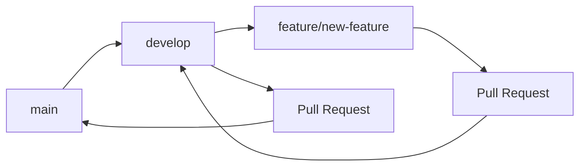
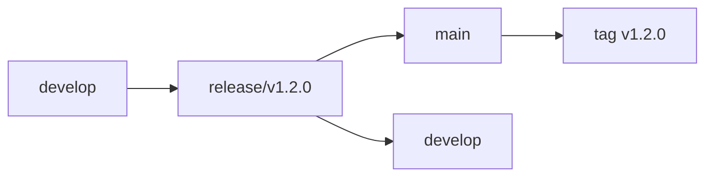
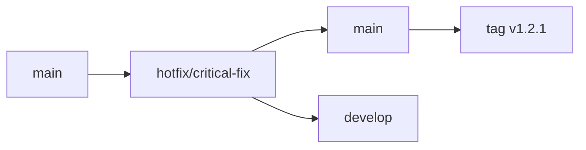

# DevOpsForge Branching Strategy 🌿

## Overview

This document outlines the branching strategy for DevOpsForge, following industry best practices for open-source projects. Our strategy is based on **GitFlow** with modifications for modern development workflows.

## Branch Types

### 🌳 **Main Branches**

#### `main` (Production)
- **Purpose**: Production-ready code, stable releases
- **Protection**: ✅ Protected, requires PR reviews
- **Deployment**: Automatic PyPI publishing on merge
- **Naming**: `main` (formerly `master`)

#### `develop` (Development)
- **Purpose**: Integration branch for features and fixes
- **Protection**: ✅ Protected, requires PR reviews
- **Deployment**: CI/CD testing and validation
- **Naming**: `develop`

### 🌿 **Feature Branches**

#### `feature/*` (Feature Development)
- **Purpose**: New features and enhancements
- **Naming Convention**: `feature/descriptive-name`
- **Examples**:
  - `feature/kubernetes-support`
  - `feature/aws-integration`
  - `feature/improved-ui`

#### `enhancement/*` (Improvements)
- **Purpose**: Enhancements to existing features
- **Naming Convention**: `enhancement/descriptive-name`
- **Examples**:
  - `enhancement/docker-optimization`
  - `enhancement/security-scanning`
  - `enhancement/performance-improvements`

### 🐛 **Bug Fix Branches**

#### `bugfix/*` (Bug Fixes)
- **Purpose**: Fixing bugs and issues
- **Naming Convention**: `bugfix/issue-description`
- **Examples**:
  - `bugfix/windows-path-handling`
  - `bugfix/python-3.8-compatibility`
  - `bugfix/template-rendering-error`

#### `hotfix/*` (Critical Fixes)
- **Purpose**: Critical production fixes
- **Naming Convention**: `hotfix/critical-issue-description`
- **Examples**:
  - `hotfix/security-vulnerability`
  - `hotfix/critical-crash-fix`
  - `hotfix/breaking-change-fix`

### 📚 **Documentation Branches**

#### `docs/*` (Documentation)
- **Purpose**: Documentation updates and improvements
- **Naming Convention**: `docs/description`
- **Examples**:
  - `docs/api-reference`
  - `docs/installation-guide`
  - `docs/contributing-updates`

### 🧪 **Testing Branches**

#### `test/*` (Testing)
- **Purpose**: Testing new features or configurations
- **Naming Convention**: `test/description`
- **Examples**:
  - `test/ci-pipeline-updates`
  - `test/new-test-framework`
  - `test/integration-tests`

## Workflow

### 🚀 **Feature Development Workflow**



1. **Create Feature Branch**
   ```bash
   git checkout develop
   git pull origin develop
   git checkout -b feature/new-feature
   ```

2. **Develop and Commit**
   ```bash
   # Make changes
   git add .
   git commit -m "feat: add new feature description"
   ```

3. **Push and Create PR**
   ```bash
   git push origin feature/new-feature
   # Create Pull Request to develop
   ```

4. **Code Review and Merge**
   - Code review by maintainers
   - CI/CD checks must pass
   - Merge to `develop`

### 🔄 **Release Workflow**



1. **Create Release Branch**
   ```bash
   git checkout develop
   git pull origin develop
   git checkout -b release/v1.2.0
   ```

2. **Prepare Release**
   - Update version numbers
   - Update CHANGELOG.md
   - Final testing and validation

3. **Merge to Main**
   ```bash
   git checkout main
   git merge release/v1.2.0
   git tag v1.2.0
   git push origin main --tags
   ```

4. **Backmerge to Develop**
   ```bash
   git checkout develop
   git merge release/v1.2.0
   git push origin develop
   ```

5. **Delete Release Branch**
   ```bash
   git branch -d release/v1.2.0
   git push origin --delete release/v1.2.0
   ```

### 🚨 **Hotfix Workflow**



1. **Create Hotfix Branch**
   ```bash
   git checkout main
   git pull origin main
   git checkout -b hotfix/critical-fix
   ```

2. **Fix and Test**
   - Implement critical fix
   - Update version number
   - Test thoroughly

3. **Merge to Main**
   ```bash
   git checkout main
   git merge hotfix/critical-fix
   git tag v1.2.1
   git push origin main --tags
   ```

4. **Backmerge to Develop**
   ```bash
   git checkout develop
   git merge hotfix/critical-fix
   git push origin develop
   ```

5. **Delete Hotfix Branch**
   ```bash
   git branch -d hotfix/critical-fix
   git push origin --delete hotfix/critical-fix
   ```

## Branch Protection Rules

### 🛡️ **Main Branch Protection**

- **Require pull request reviews**: ✅ 2 approvals minimum
- **Dismiss stale reviews**: ✅ When new commits are pushed
- **Require status checks**: ✅ CI/CD must pass
- **Require branches to be up to date**: ✅ Before merging
- **Restrict pushes**: ✅ Only maintainers can push directly

### 🛡️ **Develop Branch Protection**

- **Require pull request reviews**: ✅ 1 approval minimum
- **Require status checks**: ✅ CI/CD must pass
- **Restrict pushes**: ✅ Only maintainers can push directly

## Commit Message Convention

### 📝 **Conventional Commits**

We follow the [Conventional Commits](https://www.conventionalcommits.org/) specification:

```
type(scope): description

[optional body]

[optional footer]
```

#### **Types**
- `feat`: New feature
- `fix`: Bug fix
- `docs`: Documentation changes
- `style`: Code style changes (formatting, etc.)
- `refactor`: Code refactoring
- `test`: Adding or updating tests
- `chore`: Maintenance tasks

#### **Examples**
```bash
feat(analyzer): add support for Go modules
fix(cli): resolve path handling issue on Windows
docs(readme): update installation instructions
style(analyzer): format code with black
refactor(templates): simplify Dockerfile generation
test(cli): add integration tests for generate command
chore(deps): update dependencies to latest versions
```

## Version Management

### 🏷️ **Semantic Versioning**

We follow [Semantic Versioning](https://semver.org/) (MAJOR.MINOR.PATCH):

- **MAJOR**: Breaking changes, incompatible API changes
- **MINOR**: New functionality, backward compatible
- **PATCH**: Bug fixes, backward compatible

### 📋 **Version Update Process**

1. **Feature Branches**: No version changes
2. **Release Branches**: Update version numbers
3. **Hotfix Branches**: Update patch version
4. **Main Branch**: Tag releases

## CI/CD Integration

### 🔄 **Branch-Specific Workflows**

- **`main`**: Full CI/CD pipeline + PyPI publishing
- **`develop`**: Full CI/CD pipeline (no publishing)
- **`feature/*`**: Testing and linting only
- **`release/*`**: Full CI/CD pipeline + release preparation
- **`hotfix/*`**: Full CI/CD pipeline + hotfix preparation

### ✅ **Required Checks**

- **Linting**: flake8, black, isort
- **Testing**: pytest with coverage
- **Security**: safety, bandit
- **Build**: Package building and validation

## Best Practices

### 🌟 **Do's**

- ✅ Always create feature branches from `develop`
- ✅ Use descriptive branch names
- ✅ Write clear commit messages
- ✅ Keep branches focused and small
- ✅ Update documentation with code changes
- ✅ Test thoroughly before creating PRs

### ❌ **Don'ts**

- ❌ Don't work directly on `main` or `develop`
- ❌ Don't merge without code review
- ❌ Don't skip CI/CD checks
- ❌ Don't create long-lived feature branches
- ❌ Don't commit directly to protected branches

## Tools and Automation

### 🛠️ **Git Hooks**

- **Pre-commit**: Linting and formatting checks
- **Pre-push**: Test execution
- **Commit-msg**: Conventional commit validation

### 🤖 **GitHub Actions**

- **Automated testing** on all branches
- **Code quality checks** (linting, formatting)
- **Security scanning** and vulnerability checks
- **Automatic PyPI publishing** on main branch releases

## Emergency Procedures

### 🚨 **Critical Issues**

1. **Create hotfix branch** from `main`
2. **Implement fix** with minimal changes
3. **Test thoroughly** in hotfix branch
4. **Merge to main** and tag release
5. **Backmerge to develop**
6. **Deploy immediately**

### 🔄 **Rollback Procedures**

1. **Identify problematic commit**
2. **Create hotfix branch** from last known good commit
3. **Revert changes** or implement fix
4. **Test thoroughly**
5. **Deploy hotfix**
6. **Update documentation**

---

## Summary

This branching strategy ensures:
- **Stable production code** with `main` branch
- **Continuous integration** with `develop` branch
- **Organized feature development** with feature branches
- **Quick critical fixes** with hotfix branches
- **Quality assurance** through CI/CD and code reviews
- **Professional release management** with semantic versioning

For questions or suggestions about this strategy, please open an issue or discussion on GitHub.
